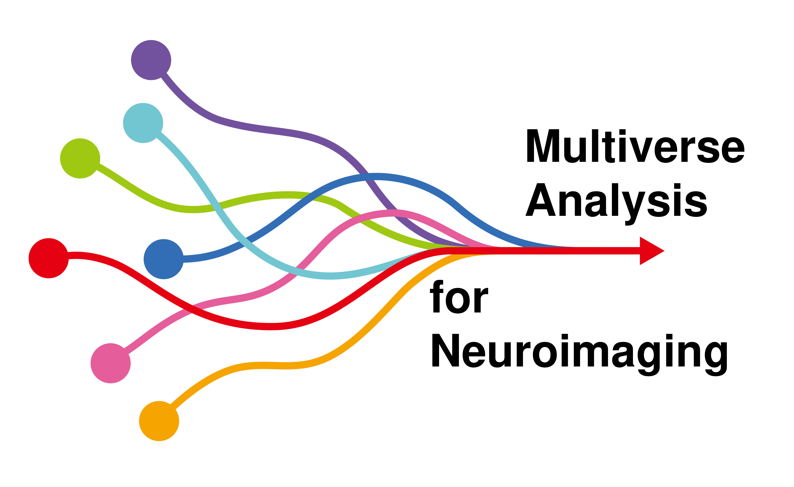

<div style="padding-top:1em; padding-bottom: 0.5em;">

</div>

# Multiverse Analysis for Neuroimaging

**NOTE: WORK IN PROGRESS**

## Online usage (recommended)

Course materials for the Multiverse Analysis for Neuroimaging workshop from the PuG 2025 conference. The content should primarily be accessed from the online book: [](https://pmus-lab.github.io/pug2025-workshop/)

## Local usage

Running the book locally requires to first build the book from source:

```python
cd <path/to/book/>
pip install -r requirements.txt
jb build .
```

This will create the html files in the `_build/` folder. The book can then be used by opening the `_build/html/index.html` file in a browser. The *.ipynb* notebooks for the exercises are located in the `book/` folder and can can either be opened locally or through Google Colab.
